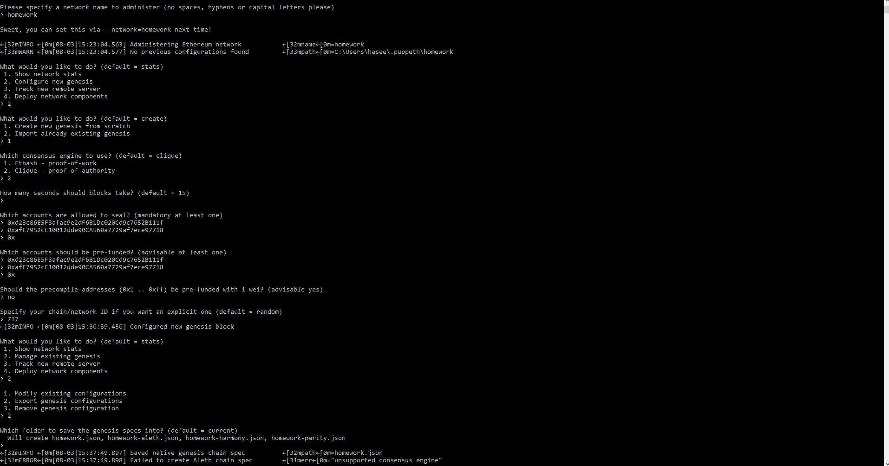
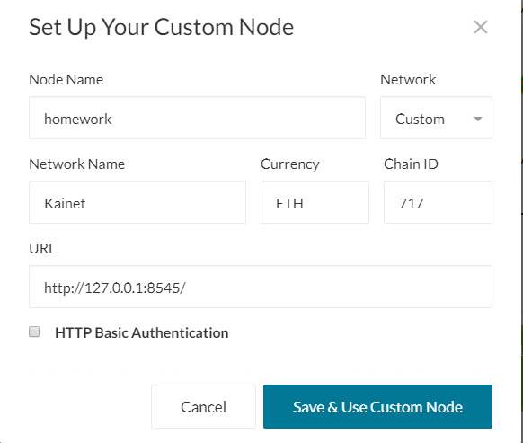

# Creating a Blockchain 

## This README file will show the step-by-step process to create a Proof of Authority blockchain.

1. Begin by going into the BlockchainTools directory and create 2 node accounts for the network using the geth functions: 

    - "./geth --datadir node1 account new"
    - "./geth --datadir node2 account new"

2. We then generate our genesis block by running the command: "./puppeth", and then follow these steps:
    
    1. input a network name
    2. choose Clique
    3. copy and paste both addresses
    4. repeat step3
    5. choose a network ID of your choice
    6. choose no
    7. export genesis configurations

3. Now we need to enter these commands to initialize the nodes(in my case i name my network 'homework'):
    - ./geth --datadir node1 init homework.json
    - ./geth --datadir node2 init homework.json

4. Finally, we may begin the mining process by entering these commands in separate terminals:
    - ./geth --datadir node1 --unlock "SEALER_ONE_ADDRESS" --mine --rpc --allow-insecure-unlock
    - ./geth --datadir node2 --unlock "SEALER_TWO_ADDRESS" --mine --port 30304 --bootnodes "enode://SEALER_ONE_ENODE_ADDRESS@127.0.0.1:30303" --ipcdisable --allow-insecure-unlock

5. Now that the nodes are running, lets add the blockchain to Mycrypto and perform a test transaction. Select change network and 'add custom node', input the information setup during the genesis creation.
    - enter "http://127.0.0.1:8545" for URL as to identify local host

6. Afterwards go to keystore file and navigate to the node1 directory to unlock and go into that wallet. Now for the final step perform a transaction to the seconde node address created to test whether our blockchain network is fully functioning!
