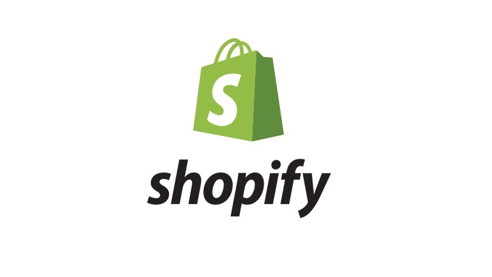

# Fintech Case Study 1

## Overview and Origin

* Name of Company: Shopify
* Date Incorporated: June, 2006
* Founders: Tobias Lütke, Daniel Weinland, Scott Lake
* After attempting to open the online snowboarding equipment store Snowdevil, Lütke was disappointed with the ecommerce ecosystem at that time and eventually decided to build his own ecommerce platform.
* Currently, Shopify has acquired a total of $122.3 million in funding.
---
## Business Activities:

* Shopify provides businesses an all-in-one ecommerce platform to sell their products with ease. Businesses are able to store data, add products, and process orders on this could-based software, whilst also being given a variety of tools to create, and modify their own product selling website.
* Businesses are able to set up Shopify Payments, which eliminates the trouble of setting up a third-party payment provider and having to enter credentials into Shopify.
* Shopify's multiple pricing plans fits business sizes ranging from startups, all the way, to medium-sized enterprises. It is powering over 1 million businesses: 20% of the market share.
* Shopify encourages individual retailers to advertise and sell their products online, in-store, and even on social media whereas platforms, such as Amazon and eBay, mainly want retailers to supply on their website and unavoidably starting price wars against each other. 

---
## Landscape:
* Shopify is in the Payments and Billing domain of the financial industry.
* Recently, payment trends have been moving towards becoming frictionless and invisible. On top of aiming to supply quicker transactions and automatic subscription charges, providers are also attempting to simplify the transaction process by demanding less information for the payer input.
* Major Competitors include: Paypal, Amazon Pay, Google Pay, Apple Pay

---
## Results:
* Shopify has contributed $319 billion in economic activity globally, between 2016 to 2019, and has created over 2.1 million jobs. The online sales growth of businesses on Shopify is 50%, which is more than twice the growth of global ecommerce market.
* Checkout conversion rate, win rate of unenecessary chargebacks, and payment rejection rate are some of the core metrics of measuring the success in Payments and Billing. 
    - By using Shopify Payments on desktops, the conversion rate is 1.56 times better than regular checkout. This is even more significant when on mobile, where is becomes 1.91 times better. 
    - Shopify's Automatic Dispute Response will be able increase the win rate of unnecessary chargebacks by to 37%. This is 17% higher than the baseline win rate.
    - Regular cost-plus payment processors reject 4.6% more of total credit card transactions that Shopify Payments.

---
## Recommendations:
* Shopify could use Artifical Inteligence and the consumer purchasing data to build models that will be able to show businesses current consumer demands and potential market opportunities of certain products. By giving its businesses more information on the future ecommerce market trend, Shopify could further enhance the growth of these businesses and also attract new suppliers to its platform.

---
## Reference:
Ecommerce software, online store Builder, POS - free 14-day trial by Shopify. (n.d.). Retrieved February 13, 2021, from https://www.shopify.ca/about
Gaubys, J. (n.d.). Ecommerce platform market share in the Us [Dec 2020 data]. Retrieved February 13, 2021, from https://www.oberlo.com/statistics/ecommerce-platform-market-share-in-usa
Hull, P. (2021, January 26). What is shopify & how does it work for selling online? Retrieved February 13, 2021, from https://www.merchantmaverick.com/what-is-shopify-and-how-does-shopify-work/
Mense, E. (2020, December 07). 9 payment trends that will shape 2020. Retrieved February 13, 2021, from https://home.bluesnap.com/snap-center/blog/9-payment-trends-that-will-shape-2020/
Shopify - Crunchbase company profile & funding. (n.d.). Retrieved February 13, 2021, from https://www.crunchbase.com/organization/shopify
Shopify payments makes you money through higher conversion rates and fewer chargebacks. (2020, August 31). Retrieved February 13, 2021, from https://www.shopify.ca/blog/shopify-payments
Shopify. (2021, February 08). Retrieved February 13, 2021, from https://en.wikipedia.org/wiki/Shopify
Shopify's Global Economic Impact Report. (n.d.).
Sularia, S. (2021, January 22). Council post: HOW Shopify is shifting the E-commerce landscape. Retrieved February 13, 2021, from https://www.forbes.com/sites/forbestechcouncil/2021/01/22/how-shopify-is-shifting-the-e-commerce-landscape/?sh=4ac3b0563ce9